# Quark Architecture Documentation

> Generated from knowledge graph: **Quark** — 1,798 files · 42,436 symbols · 300 execution flows · 75 functional areas

## Overview

Quark is AMD's open-source model quantization framework providing dual-backend quantization support for **PyTorch** and **ONNX**. It covers the full pipeline from Post-Training Quantization (PTQ) through Quantization-Aware Training (QAT) to hardware-specific deployment, targeting AMD NPU, RyzenAI, and general-purpose hardware.

### Quantization Pipeline

```
Model → Pre-quant → Calibration → Quantization → Post-quant → Optimization → Export
         │              │              │              │              │
    BN Folding     Observer       QDQ Insert     Refinement    ONNX / GGUF
    Shape Fix      MinMax/         FakeQuant      Bias Align    HF / JSON
    Op Adapt       Histogram       BFP / NBits    CLE           Safetensors
```

---

## Functional Areas

### Core Quantization

| Module | Symbols | Cohesion | Description |
|--------|---------|----------|-------------|
| **Quantization** | 111 | 61% | Core quantization logic: static/dynamic quantization dispatch, config mapping, tensor quantize/dequantize |
| **Config** | 83 | 84% | Configuration system: `QConfig` → `QLayerConfig` → `QTensorConfig`, dtype/qscheme/scale/round definitions |
| **Observer** | 56 | 74% | Calibration observers: MinMax, Histogram, MSE, Percentile, PerChannel, PerGroup, PerTensor, MX formats |
| **Calibration** | 59 | 61% | ONNX calibration: data collectors, calibrators (MinMax, Percentile, MSE), inference sessions |
| **Operators** | 81 | 93% | Custom quantized ONNX operators (hardsigmoid, etc.) |

### Quantization Flow Stages

| Module | Symbols | Cohesion | Description |
|--------|---------|----------|-------------|
| **Pre_quant** | 55 | 63% | Pre-quantization passes: BN folding, Cross-Layer Equalization, shape fixing, bias init |
| **Post_quant** | 54 | 52% | Post-quantization: bias scale correction, refinement, swish/sigmoid pattern detection |
| **Refinement** | 50 | 64% | Accuracy refinement: layer-wise optimization, output evaluation |
| **Optimizations** | 70 | 44% | Graph optimization: QDQ removal, QOP conversion, pattern matching, model transformation |
| **Processor** | 58 | 79% | Torch graph processor: node annotation, quantizer insertion, pre-check validation |

### Algorithms

| Module | Symbols | Cohesion | Description |
|--------|---------|----------|-------------|
| **Awq** | 54 | 59% | AWQ (Activation-aware Weight Quantization): scale search, clipping, auto-smooth, MoE support |
| **Brevitas** | 53 | 89% | Brevitas integration: GPFQ algorithm, pre-processing, config validation, ONNX export |
| **Passes** | 249 | 68% | RyzenAI ONNX transformation passes: conv reshaping, gather/transpose swap, concat fusion |

### Backend & Hardware

| Module | Symbols | Cohesion | Description |
|--------|---------|----------|-------------|
| **Npu** | 138 | 58% | AMD NPU-specific quantization: CNN quantizer (XINT8), Transformer quantizer |
| **Ryzenai_onnx_utils** | 137 | 80% | RyzenAI utilities: LLM full fusion, strategy builder, GenAI config |
| **Create_torch** | 68 | 77% | Torch model creation for ONNX training/finetuning subgraphs |

### Model & Export

| Module | Symbols | Cohesion | Description |
|--------|---------|----------|-------------|
| **Modules** | 52 | 76% | Quantized nn.Module classes: QuantConv2d, QuantLinear, QuantEmbedding, QuantMixin |
| **Sd3** | 138 | 81% | Stable Diffusion 3 model support and quantization |

---

## Key Execution Flows

### 1. ONNX Quantization Flow (8 steps)

```
quantize_model
  → _quantize_normal_tensors
    → _add_qdq_pair_for_initializer
      → quantize_weight_per_channel
        → quantize_weight_per_channel_impl
          → quantize_data
            → compute_minmse
              → get_qmin_qmax_for_qType / dequantize_data
```

**Entry**: `quark/onnx/quantizers/npu_cnn_quantizer.py` → `ModelQuantizer.quantize_model()`
**Key files**: `quark/onnx/quantizers/qdq_quantizer.py`, `quark/onnx/quantization/quant_utils.py`

### 2. Fast Finetuning Flow (6 steps)

```
fast_finetune
  → get_training_data
    → get_q_input_data
      → extract_sub_model
        → create_tmp_dir
          → warning
```

**Entry**: `quark/onnx/algorithm/finetuning/fast_finetune.py`
**Purpose**: Extract subgraphs from quantized models for targeted finetuning to recover accuracy.

### 3. LLM Full Fusion Flow (6 steps)

```
llm_full_fusion
  → set_option
    → set_session_option
      → _session_options
        → _config_model
          → _config_model_static
```

**Entry**: `quark/contrib/onnx_utils/src/ryzenai_onnx_utils/optimize.py`
**Purpose**: Full-graph fusion optimization for LLM deployment on RyzenAI NPU.

### 4. Torch Quantization Flow

```
ModelQuantizer.quantize_model()
  ├── _check_model_device          → Multi-device accelerate support
  ├── _prepare_model               → eager_mode or fx_graph_mode
  ├── _apply_advanced_quant_algo   → GPTQ / AWQ / Qronos / Rotation
  ├── _do_calibration              → Weight + Activation calibration
  ├── _do_post_calib_optimazation  → Hardware constraint alignment
  └── [optional] Freeze            → FrozenFakeQuantize for compilation/export
```

**Entry**: `quark/torch/quantization/api.py:103`

### 5. Export Flow

```
Export Pipeline
  ├── ONNX Export     → OnnxExporter (quark/torch/export/api.py)
  ├── GGUF Export     → GGUF format for llama.cpp
  ├── HF Export       → HuggingFace safetensors format
  ├── JSON Export     → Structured config + params
  └── torch.export    → torch.export.load for fx_graph mode
```

---

## Architecture Diagram

```mermaid
graph TB
    subgraph "Public API"
        TORCH_API["ModelQuantizer<br/>(torch)"]
        ONNX_API["ModelQuantizer<br/>(onnx)"]
        LOAD["load_params / save_params"]
    end

    subgraph "Configuration"
        CONFIG["QConfig → QLayerConfig → QTensorConfig"]
        DTYPE["Dtype / QSchemeType / ScaleType"]
        OBS["Observer: MinMax, Histogram, MSE..."]
    end

    subgraph "Torch Quantization Engine"
        EAGER["Eager Mode<br/>QuantConv2d / QuantLinear"]
        FX["FX Graph Mode<br/>GraphModelQuantizer"]
        PROC["Processor<br/>annotate / insert_quantizer"]
    end

    subgraph "ONNX Quantization Engine"
        QDQ["QDQQuantizer"]
        BFP["BFPQDQQuantizer"]
        MATMUL["MatMulNBitsQuantizer"]
        NPU_Q["NPU CNN / Transformer Quantizer"]
    end

    subgraph "Advanced Algorithms"
        GPTQ["GPTQ"]
        AWQ["AWQ / AutoSmooth"]
        QRONOS["Qronos"]
        SMOOTH["SmoothQuant"]
        QUAROT["QuaRot"]
        ADAROUND["AdaRound / AdaQuant"]
        CLE["CrossLayerEqualization"]
        ROT["Rotation"]
    end

    subgraph "Calibration"
        CALIB["ONNX: DataCollector / Calibrator"]
        OBS2["Torch: ScaledFakeQuantize"]
    end

    subgraph "Optimization Passes"
        PRE["Pre-quant: BN fold, CLE"]
        POST["Post-quant: bias align, refine"]
        OPT["Graph: QDQ remove, QOP convert"]
        PASSES["RyzenAI Passes"]
    end

    subgraph "Export & Deployment"
        ONNX_EXP["ONNX Export"]
        GGUF["GGUF Export"]
        HF_EXP["HuggingFace Export"]
        JSON_EXP["JSON Export"]
        BREVITAS["Brevitas ONNX"]
    end

    subgraph "Hardware Targets"
        NPU["AMD NPU"]
        RYZEN["RyzenAI"]
        CPU["CPU / GPU"]
    end

    subgraph "Shared"
        SHARES["quark.shares<br/>config base / utils / log"]
    end

    TORCH_API --> CONFIG
    ONNX_API --> CONFIG
    CONFIG --> OBS

    TORCH_API --> EAGER
    TORCH_API --> FX
    FX --> PROC

    ONNX_API --> QDQ
    ONNX_API --> BFP
    ONNX_API --> MATMUL
    ONNX_API --> NPU_Q

    TORCH_API --> AWQ
    TORCH_API --> GPTQ
    TORCH_API --> QRONOS
    TORCH_API --> SMOOTH
    TORCH_API --> QUAROT
    TORCH_API --> ROT

    ONNX_API --> ADAROUND
    ONNX_API --> CLE

    EAGER --> CALIB
    FX --> CALIB
    QDQ --> CALIB

    EAGER --> PRE
    FX --> PRE
    QDQ --> PRE

    QDQ --> POST
    QDQ --> OPT
    PASSES --> OPT

    TORCH_API --> ONNX_EXP
    TORCH_API --> GGUF
    TORCH_API --> HF_EXP
    TORCH_API --> JSON_EXP
    BREVITAS --> ONNX_EXP

    ONNX_EXP --> NPU
    ONNX_EXP --> RYZEN
    PASSES --> RYZEN
    NPU_Q --> NPU

    ONNX_EXP --> CPU
    HF_EXP --> CPU

    TORCH_API -.-> SHARES
    ONNX_API -.-> SHARES
    QDQ -.-> SHARES

    style TORCH_API fill:#f9a03f,color:#000
    style ONNX_API fill:#f9a03f,color:#000
    style CONFIG fill:#7b9ea8,color:#000
    style AWQ fill:#c6a5cc,color:#000
    style NPU fill:#4c9f70,color:#000
    style RYZEN fill:#4c9f70,color:#000
```



---

## Module Relationships

```
test_for_torch (207)          test_for_onnx (372)
       │                              │
       ▼                              ▼
┌──────────────────┐      ┌──────────────────────┐
│  torch.quantization│      │  onnx.quantization   │
│  ├─ api.py         │      │  ├─ api.py           │
│  ├─ graph/         │      │  ├─ quantize.py      │
│  │  ├─ processor/  │      │  ├─ config/          │
│  │  └─ optimization│      │  └─ quant_utils.py   │
│  ├─ config/        │      ├─ quantizers/         │
│  ├─ observer/      │      │  ├─ qdq_quantizer    │
│  ├─ nn/modules/    │      │  ├─ bfp_quantizer    │
│  └─ tensor_quantize│      │  ├─ npu_cnn_quantizer│
│                     │      │  └─ extended_quantizer│
│  torch.algorithm/   │      ├─ calibration/        │
│  ├─ awq/           │      ├─ preprocess/         │
│  ├─ gptq/          │      ├─ postprocess/        │
│  ├─ qronos/        │      └─ optimizations/      │
│  └─ rotation/      │                             │
│                     │      onnx_adapter/          │
│  torch.export/      │      └─ passes/             │
│  ├─ onnx.py        │                             │
│  ├─ gguf_export/   │      contrib/               │
│  ├─ json_export/   │      └─ ryzenai_onnx_utils/ │
│  └─ safetensors.py │                             │
└────────┬───────────┘      └───────────┬──────────┘
         │                              │
         └──────────┬───────────────────┘
                    ▼
            ┌──────────────┐
            │  quark.shares │
            │  ├─ config    │
            │  └─ utils     │
            └──────────────┘
```

---

## Supported Quantization Types

| Type | Torch | ONNX |
|------|-------|------|
| Static Quantization (INT8/INT16) | ✓ | ✓ |
| Dynamic Quantization | ✓ | ✓ |
| Weight-Only Quantization (INT4/INT8) | ✓ | ✓ |
| Per-Tensor Quantization | ✓ | ✓ |
| Per-Channel Quantization | ✓ | ✓ |
| Per-Group Quantization | ✓ | — |
| Block Floating Point (BFP/MX) | ✓ | ✓ |
| Power-of-2 Scale (Hardware-friendly) | ✓ | ✓ |
| Float Scale | ✓ | ✓ |
| Non-Scaled Quantization (TQT/LSQ) | ✓ | — |

## Supported Hardware

| Hardware | Via |
|----------|-----|
| AMD NPU | `npu_cnn_quantizer`, `npu_transformer_quantizer` |
| AMD RyzenAI | `ryzenai_onnx_utils` (LLM fusion, GenAI config) |
| CPU (x86/ARM) | ONNX Runtime, torch.compile |
| GPU (CUDA/ROCm) | PyTorch eager, torch.compile |

## Supported Model Architectures

- **LLMs**: LLaMA, OPT, GPT-style (via HuggingFace integration)
- **Diffusion**: Stable Diffusion 3
- **Vision**: CNN classifiers (via Brevitas integration), YOLO
- **Recommendation**: DLRM
- **Custom**: Any PyTorch `nn.Module` or ONNX model

---

## Key Design Patterns

1. **Observer Pattern**: Calibration is decoupled from quantization. Observers collect statistics (min/max/histogram) during forward passes; quantizers consume them to compute scale/zero_point.

2. **Dual Quantization Mode** (Torch): Eager mode replaces modules directly (`QuantConv2d`); FX Graph mode operates on `torch.fx.GraphModule` for graph-level optimization.

3. **Plugin Architecture** (Algorithms): Advanced algorithms register via `quark/torch/algorithm/api.py` and execute during the quantization pipeline without coupling to core logic.

4. **Quantizer Strategy Pattern** (ONNX): Multiple quantizer implementations (QDQ, BFP, MatMulNBits, NPU) share a common interface, selected by configuration.

5. **Shared Configuration Base**: `quark/shares/config.py` defines abstract base classes (`BaseQConfig`, `BaseQLayerConfig`, `BaseQTensorConfig`) reused by both Torch and ONNX backends.

6. **Pass-Based Optimization**: Both backends use composable transform passes for pre/post processing (BN folding, CLE, QDQ cleanup).

---

*Document generated from GitNexus knowledge graph on 2026-05-20*
